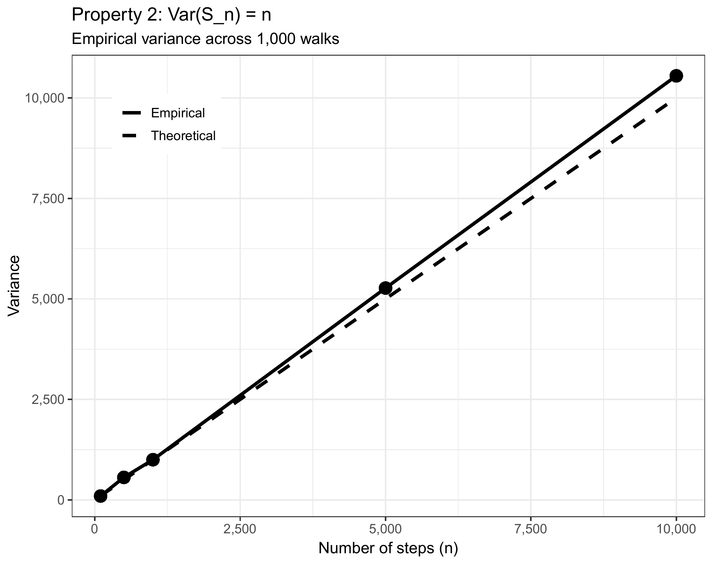
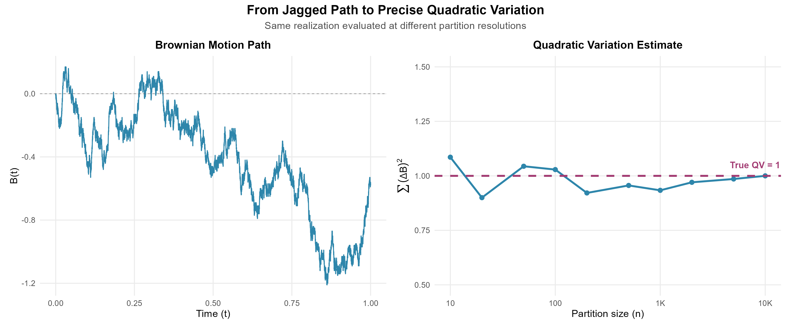

```{r setup, include=FALSE}
# Default for all chunks
knitr::opts_chunk$set(
  echo = FALSE,
  warning = FALSE,
  message = FALSE
)
# Specific defaults for figures
knitr::opts_chunk$set(
  echo = FALSE,
  fig.align = 'center',
  out.width = '80%',
  fig.width = 8,
  fig.height = 6,
  dpi = 300
)
library(tidyverse)
library(knitr)
```

# Random Walks and Brownian Motion

In 1827, botanist Robert Brown observed pollen grains suspended in water through his microscope, jittering ceaselessly in an erratic dance. Nearly eighty years later, Einstein explained this *Brownian motion*: each grain is bombarded by countless invisible water molecules, accumulating random kicks that send it on a wandering path—a continuous random walk. Yet here's the puzzle that should make you pause: in 1900, five years *before* Einstein's physics paper, a French mathematician named Louis Bachelier wrote his doctoral thesis describing stock price movements using the exact same mathematical framework. How could the physics of microscopic particles and the economics of human market behavior—phenomena separated by scales of size, time, and causation—obey identical mathematical laws? The answer hints at a deep universality: whenever a quantity evolves through the accumulation of many small, independent, unpredictable shocks—whether molecular collisions or market trades—the Central Limit Theorem sculpts the result into the same characteristic shape, regardless of the underlying details.

## Why Random Walks Matter
Imagine a particle suspended in fluid, buffeted by molecular collisions. Or the path of a stock price over time, influenced by countless buy and sell decisions. Or even the position of a gambler's fortune after many coin flips. What unifies these seemingly disparate phenomena? They all exhibit **random walk** behavior.

Random walks are fundamental models in probability theory with applications spanning physics (diffusion processes), finance (asset price modeling), biology (animal foraging), and computer science (randomized algorithms). Understanding random walks gives us the key to analyzing systems where change occurs through accumulated random shocks.

**This chapter's journey:** We'll begin with the simplest random walk—a sequence of coin flips—and discover that when properly scaled, these discrete jumps converge to a continuous process called **Brownian motion**. This limiting process is not just mathematically elegant; it's the foundation of stochastic calculus and modern quantitative finance.

Three questions will guide us:
1. How does a random walk behave over time?
2. What happens when we standardize it?
3. How do we transition from discrete steps to continuous motion?

## Simple Random Walk

Imagine flipping a fair coin repeatedly. After each flip, you take a step: heads = +1, tails = -1. Your position after $n$ steps is:
$$S_n = X_1 + X_2 + \cdots + X_n$$
where each $X_i \in \{-1, +1\}$ with equal probability $1/2$. This is a **simple random walk**.

**Intuition:** Think of $S_n$ as your "signed distance" from where you started. Each coin flip adds a random $\pm 1$ to your position. Since the coin is fair, there's no systematic drift in any direction—but randomness ensures you won't stay at zero either.

### Key Properties

Now that we've defined the random walk, let's examine what makes it tick. Three properties will be crucial for understanding its long-term behavior:

- **Expected position**: $\mathbb{E}[S_n] = 0$ 
  
  *Interpretation:* On average, you expect to end where you started. The walk has no drift or bias.

- **Variance**: $\text{Var}(S_n) = n$ 
  
  *Interpretation:* The variance grows linearly with time. The typical distance from the origin grows, but crucially, it grows as $\sqrt{n}$, not as $n$ itself.

- **Asymptotic normality**: $\frac{S_n}{\sqrt{n}} \xrightarrow{d} N(0,1)$ as $n \to \infty$
  
  *Interpretation:* By the Central Limit Theorem, even though each step is discrete ($\pm 1$), the rescaled position becomes approximately normal for large $n$. Here $\xrightarrow{d}$ denotes convergence in distribution.

**Why these properties matter:** The first two tell us about the walk's center and spread. The third—asymptotic normality—is profound: it means that regardless of the distribution of individual steps, their sum (properly scaled) becomes Gaussian. This universality is what makes random walks so powerful as models.

> **💭 Thought Exercise:** Why does variance grow linearly with $n$ but standard deviation grow as $\sqrt{n}$? What does this imply about how "surprising" a deviation of size $k$ becomes as time progresses?
>
> *Hint:* Since $\text{SD}(S_n) = \sqrt{n}$, a deviation of fixed size $k$ represents $k/\sqrt{n}$ standard deviations. As $n$ increases, the same absolute deviation becomes less and less surprising in relative terms.

### Visualizing Random Walk Behavior

Theory is one thing, but seeing is believing. The following simulations will demonstrate each property we just discussed. As you examine each plot, ask yourself:
- Does the behavior match our mathematical predictions?
- What patterns emerge as time increases?
- Can you visually identify the $\sqrt{n}$ scaling in the spread?
```{r rw_simulate, fig.cap="Five independent random walk paths over 1000 steps. Each colored line represents one realization of the random walk process."}
knitr::include_graphics(c("figures/random_walk_simulate.png"))
```

**What we observe:** Each path wanders unpredictably—sometimes venturing far from zero, other times hovering nearby. Yet they all cluster around zero on average. This is $\mathbb{E}[S_n] = 0$ in action. Notice how the spread of paths increases over time—that's the $\text{Var}(S_n) = n$ property manifesting visually. By $n = 1000$, paths range roughly from $-60$ to $+60$, which aligns with our prediction: we expect typical deviations of about $\pm 2\sqrt{1000} \approx \pm 63$ (two standard deviations).
```{r rw_sqrt, fig.cap="Random walk volatility envelope. The dashed lines show $\\pm 1$ standard deviation bounds, which grow as $\\sqrt{n}$."}
knitr::include_graphics("figures/random_sd_sqrt_n.png")
```

**Theory predicts:** The standard deviation envelope should grow as $\sqrt{n}$. At $n = 100$, we expect $\text{SD} \approx 10$. At $n = 400$, we expect $\text{SD} \approx 20$ (doubling the time quadruples the variance but only doubles the standard deviation). At $n = 1000$, we expect $\text{SD} \approx 31.6$.

**What the plot confirms:** The $\pm 1\sigma$ envelope (dashed lines) indeed follows the $\sqrt{n}$ curve. The sample path wanders within and occasionally beyond this envelope, exactly as we'd expect from a process whose deviations follow a normal distribution (recall that roughly 68% of a normal distribution lies within $\pm 1\sigma$).

**Empirical verification:** Simulating many random walks allows us to check whether sample means and variances match theoretical predictions.
```{r rw_mean, fig.cap="Empirical mean of 10,000 random walk simulations at each time point. The mean hovers near zero, confirming $\\mathbb{E}[S_n] = 0$."}
knitr::include_graphics("figures/random_walk_mean.png")
```

**What we see:** The empirical mean (blue line) fluctuates slightly around zero due to Monte Carlo noise, but remains remarkably close to the theoretical value. This is the Law of Large Numbers at work: averaging over 10,000 independent walks gives us an accurate estimate of the true expectation.
```{r rw_variance, fig.cap="Empirical variance of 10,000 random walk simulations. The variance grows linearly with time, confirming $\\text{Var}(S_n) = n$."}

```

**Quantitative check:** At $n = 500$, we predict $\text{Var}(S_n) = 500$. The empirical variance tracks the 45-degree line (where variance equals time) almost perfectly. Any small deviations are due to finite-sample variation—with 10,000 simulations, our estimates are quite precise.

### The Central Limit Theorem in Action

Now for the most important property: asymptotic normality. If we standardize the random walk by subtracting its mean (which is 0) and dividing by its standard deviation (which is $\sqrt{n}$), the resulting distribution should approach the standard normal:

$$Z_n := \frac{S_n - 0}{\sqrt{n}} = \frac{S_n}{\sqrt{n}} \xrightarrow{d} N(0,1)$$

**Why this rescaling?** Dividing by $\sqrt{n}$ (not $n$) is crucial. If we divided by $n$, the random walk would vanish: $S_n/n \to 0$. If we didn't divide at all, $S_n$ would diverge. The $\sqrt{n}$ factor is the "Goldilocks" scaling that keeps the variance at exactly 1 and allows convergence to a non-degenerate limit.
```{r rw_clt, fig.cap="Histograms of standardized random walks at various time points. As $n$ increases, the empirical distribution (blue bars) converges to the standard normal density (red curve)."}
knitr::include_graphics("figures/random_std_clt.png")
```

**Visual convergence:** At $n = 10$, the histogram is somewhat jagged and discrete-looking. By $n = 100$, it's smoother and closer to the normal curve. At $n = 1000$, the fit is nearly perfect. This is the Central Limit Theorem before your eyes: sums of independent random variables, when properly normalized, converge to the normal distribution.
```{r qq, fig.cap="Quantile-quantile (Q-Q) plot comparing empirical quantiles of $S_n/\\sqrt{n}$ to theoretical quantiles of $N(0,1)$. Points falling on the diagonal indicate distributional agreement."}
knitr::include_graphics("figures/random_qq.png")
```

**The Q-Q plot diagnostic:** This plot compares quantiles directly. If the standardized random walk were exactly normal, all points would fall on the diagonal line. We see excellent agreement, especially in the central range ($-2$ to $+2$). Some deviation in the extreme tails is normal—after all, we're working with finite samples and approximations.

### Synthesis: What We've Learned

Let's review the visual and mathematical evidence:

1. **Zero drift:** Random walks with symmetric steps (equal probability of $\pm 1$) have expected value zero at all times.

2. **Linear variance growth:** The variance grows as $n$, which means standard deviation grows as $\sqrt{n}$. The "uncertainty region" widens, but sub-linearly.

3. **Convergence to normality:** The standardized random walk's empirical distribution converges to the standard normal density. Mathematically:
   \begin{align}
   \frac{S_n - 0}{\sqrt{n}} &\xrightarrow{d} N(0,1)\\
   \Rightarrow \quad S_n &\xrightarrow{d} \sqrt{n} \cdot N(0,1)
   \end{align}

**Practical implication:** For large $n$, we can approximate probabilities for $S_n$ using the normal distribution. For example:
$$P(S_n \leq x) \approx \Phi\left(\frac{x}{\sqrt{n}}\right)$$
where $\Phi$ is the standard normal cumulative distribution function.

### Common Pitfalls and Misconceptions

Before moving forward, let's address some common sources of confusion:

- **❌ Misconception:** "The random walk will eventually return to zero."
  
  **✓ Reality:** While it's true that $\mathbb{E}[S_n] = 0$ for all $n$, this doesn't mean $S_n$ itself will be zero at any particular time. In fact, for a simple random walk, the probability of *ever* returning to zero is 1 (a beautiful result!), but there's no guarantee it happens within any finite time window.

- **❌ Misconception:** "I should standardize by dividing by $n$."
  
  **✓ Reality:** Dividing $S_n$ by $n$ gives $S_n/n \to 0$ (by the Law of Large Numbers), which is trivial. The correct scaling is $S_n/\sqrt{n}$, which preserves variance and yields a meaningful limit.

- **❌ Misconception:** "The next step depends on previous steps."
  
  **✓ Reality:** The random walk is **memoryless**—each $X_i$ is independent. While $S_n$ certainly depends on past steps (it's their sum!), the *increment* $X_{n+1}$ does not. This independence is crucial for many theoretical results.

- **❌ Misconception:** "Since the walk is symmetric, it spends equal time above and below zero."
  
  **✓ Reality:** This is false for finite $n$! The walk can exhibit long excursions on one side. However, the **arcsine law** tells us that over long times, the proportion of time spent positive converges to a surprisingly non-uniform distribution.

### From Discrete to Continuous: Brownian Motion Preview

We've seen that random walks, when properly scaled, converge to normal distributions at each fixed time $n$. But what if we wanted a **continuous-time** process? 

Here's the key insight: imagine taking steps more and more frequently, but making each step proportionally smaller. Specifically:

- Divide the time interval $[0, t]$ into $n$ subintervals of length $\Delta t = t/n$
- At each subinterval, take a step of size $\pm \sqrt{\Delta t}$ (not $\pm 1$!)
- Let $n \to \infty$

This limiting process—called **Donsker's invariance principle**—yields **Brownian motion** $B(t)$, a continuous-time stochastic process with remarkable properties:

- $B(0) = 0$ (starts at the origin)
- **Independent increments:** $B(t) - B(s)$ is independent of the past for $t > s$
- **Stationary increments:** $B(t) - B(s) \sim N(0, t-s)$ (depends only on time difference)
- **Continuous paths:** $B(t)$ is continuous in $t$ (though nowhere differentiable!)
```{r brownian_preview, eval=FALSE}
# Simulating the transition from random walk to Brownian motion
# (Code for illustration - not executed in this document)

simulate_scaled_walk <- function(n_steps, total_time = 1) {
  dt <- total_time / n_steps
  steps <- sample(c(-1, 1), size = n_steps, replace = TRUE) * sqrt(dt)
  times <- seq(0, total_time, length.out = n_steps + 1)
  position <- c(0, cumsum(steps))
  return(data.frame(time = times, position = position))
}

# As n_steps → ∞, this converges to Brownian motion
```

**Visual intuition:** If you plotted random walks with $n = 10, 100, 1000, 10000$ steps (each step scaled by $1/\sqrt{n}$), you'd see the paths become increasingly continuous. The limit is Brownian motion—a continuous but highly irregular function.

**Why this matters:** Brownian motion is the continuous analog of the random walk and serves as the foundation for:
- **Stochastic calculus:** Integration and differentiation with respect to random processes
- **Financial modeling:** The Black-Scholes model assumes stock prices follow geometric Brownian motion
- **Partial differential equations:** Solutions to the heat equation can be represented as expectations over Brownian paths

In the next sections, we'll formally define Brownian motion, explore its properties, and begin developing the calculus of random functions.

<!-- --- -->

<!-- ## For the Curious: Replicating the Simulations -->

<!-- While we've hidden the code to focus on concepts, here's how you could generate your own random walk simulations: -->
<!-- ```{r example_code, echo=TRUE, eval=FALSE} -->
<!-- # Generate one random walk path -->
<!-- set.seed(123) -->
<!-- n_steps <- 1000 -->
<!-- steps <- sample(c(-1, 1), size = n_steps, replace = TRUE) -->
<!-- position <- cumsum(steps) -->

<!-- # Plot -->
<!-- library(ggplot2) -->
<!-- ggplot(data.frame(time = 1:n_steps, position = position),  -->
<!--        aes(x = time, y = position)) + -->
<!--   geom_line(color = "blue") + -->
<!--   geom_hline(yintercept = 0, linetype = "dashed", color = "red") + -->
<!--   labs(title = "A Single Random Walk", -->
<!--        x = "Time (n)",  -->
<!--        y = "Position (Sₙ)") + -->
<!--   theme_minimal() -->

<!-- # For multiple paths -->
<!-- n_paths <- 5 -->
<!-- walks <- replicate(n_paths, cumsum(sample(c(-1, 1), n_steps, replace = TRUE))) -->

<!-- # Convert to long format for ggplot -->
<!-- library(tidyr) -->
<!-- walks_df <- as.data.frame(walks) %>% -->
<!--   mutate(time = 1:n_steps) %>% -->
<!--   pivot_longer(-time, names_to = "path", values_to = "position") -->

<!-- ggplot(walks_df, aes(x = time, y = position, color = path)) + -->
<!--   geom_line(alpha = 0.7) + -->
<!--   geom_hline(yintercept = 0, linetype = "dashed") + -->
<!--   labs(title = "Five Independent Random Walk Paths", -->
<!--        x = "Time (n)",  -->
<!--        y = "Position (Sₙ)") + -->
<!--   theme_minimal() + -->
<!--   theme(legend.position = "none") -->
<!-- ``` -->

<!-- **Exercise:** Try modifying the code to create a biased random walk where $P(X_i = +1) = 0.6$ and $P(X_i = -1) = 0.4$. How do the properties change? What is $\mathbb{E}[S_n]$ now? -->

<!-- --- -->

<!-- ## Key Takeaways -->

<!-- Before moving to the next section, make sure you understand: -->

<!-- 1. **Definition:** A simple random walk is the cumulative sum of independent $\pm 1$ steps. -->

<!-- 2. **Moment formulas:** $\mathbb{E}[S_n] = 0$ and $\text{Var}(S_n) = n$ for symmetric steps. -->

<!-- 3. **Scaling behavior:** Typical deviations grow as $\sqrt{n}$, not $n$. -->

<!-- 4. **Central Limit Theorem:** $S_n / \sqrt{n} \xrightarrow{d} N(0,1)$ as $n \to \infty$. -->

<!-- 5. **Path to Brownian motion:** Continuous-time limits of scaled random walks yield Brownian motion. -->

<!-- If any of these points feel unclear, revisit the relevant section or work through the suggested exercises. These foundations are essential for everything that follows. -->

## From Discrete Steps to Continuous Paths

We've thoroughly explored the simple random walk—a process that jumps at discrete integer times $n = 1, 2, 3, \ldots$. But many real phenomena unfold continuously: pollen grains don't wait for a clock to tick before changing direction, and stock prices can move at any instant during trading hours. How do we bridge this gap?

The key insight: we'll take our discrete random walk and refine it twice—making steps **more frequent** and **smaller**—in just the right proportion so that something meaningful survives in the limit.

### The Scaling Thought Experiment

Imagine we want to model a process over time interval $[0, t]$. We'll compare three different strategies:

**Strategy 1 (Naive):** Divide $[0, t]$ into $n$ subintervals of length $\Delta t = t/n$. At each subinterval, take a step of size $\pm 1$.
- Position after $n$ steps: $S_n \approx \sqrt{n} \sim \sqrt{t/\Delta t}$
- As $\Delta t \to 0$: $S_n \to \infty$ (diverges!)

**Strategy 2 (Over-correction):** Use step size $\pm \Delta t$ instead.
- Position: $S_n \approx \sqrt{n} \cdot \Delta t \sim \sqrt{n/t^2} \to 0$ (vanishes!)

**Strategy 3 (Goldilocks):** Use step size $\pm \sqrt{\Delta t}$.
- Position variance: $n \cdot (\sqrt{\Delta t})^2 = n \cdot \Delta t = (t/\Delta t) \cdot \Delta t = t$ ✓
- As $\Delta t \to 0$: we get a non-trivial limit!

The third strategy is the magic formula. Let's see why it works mathematically.

### The Crucial Scaling Derivation

Suppose we divide the time interval $[0, t]$ into $n$ subintervals of length $\Delta t = t/n$. At each time step, we take a random step of size $\Delta x$.

After $n$ steps, our position is:
$$S_n = \sum_{i=1}^{n} X_i$$
where each $X_i \in \{-\Delta x, +\Delta x\}$ with equal probability.

We already know:
- $\mathbb{E}[S_n] = 0$ (regardless of $\Delta x$)
- $\text{Var}(S_n) = n \cdot (\Delta x)^2$

**What should the variance be?** If we want the limiting process to have variance proportional to elapsed time $t$ (as we've seen with random walks where $\text{Var}(S_n) = n$), we need:
$$\text{Var}(S_n) = n \cdot (\Delta x)^2 = t$$

Substituting $n = t/\Delta t$:
$$\frac{t}{\Delta t} \cdot (\Delta x)^2 = t$$

Solving for $\Delta x$:
$$(\Delta x)^2 = \Delta t \quad \Rightarrow \quad \boxed{\Delta x = \sqrt{\Delta t}}$$

**The profound implication:** As we make time steps smaller by a factor of $k$ (i.e., $\Delta t \to \Delta t/k$), we must make spatial steps smaller by a factor of $\sqrt{k}$ (i.e., $\Delta x \to \Delta x/\sqrt{k}$). Steps shrink, but only like the **square root** of the time resolution.

> **💭 Intuition Check:** Why square root scaling? Think back to our random walk property: $\text{SD}(S_n) = \sqrt{n}$. When we compress $n$ steps into a fixed time interval $t$, we need each step's contribution to scale as $1/\sqrt{n}$ so that the total variance remains finite.

### Visualizing the Convergence

Let's see this convergence in action by simulating random walks with increasingly fine time discretizations:
<!-- Let's see this convergence in action: -->
```{r brownian-convergence-animation}

library(tidyverse)

set.seed(2024)

# Generate walks at six different discretization levels
n_values <- c(10, 25, 50, 100, 500, 10000)

walks_detailed <- map_dfr(n_values, function(n) {
  dt <- 1 / n
  step_size <- sqrt(dt)
  steps <- sample(c(-1, 1), size = n, replace = TRUE) * step_size
  times <- seq(0, 1, length.out = n + 1)
  position <- c(0, cumsum(steps))
  
  data.frame(
    time = times,
    position = position,
    n = n
  )
}) %>%
  mutate(
    n_label = factor(
      paste("n =", format(n, big.mark = ",")),
      levels = paste("n =", format(n_values, big.mark = ","))
    )
  )

# Create detailed grid plot
ggplot(walks_detailed, aes(x = time, y = position)) +
  geom_line(color = "#2E86AB", linewidth = 0.7) +
  geom_hline(yintercept = 0, linetype = "dashed", 
             color = "gray40", linewidth = 0.3, alpha = 0.7) +
  facet_wrap(~ n_label, ncol = 3, scales = "free_y") +
  labs(
    title = "Progressive Refinement: Random Walk → Brownian Motion",
    subtitle = expression(paste("Each panel uses step size ", Delta*x == sqrt(Delta*t), 
                                " where ", Delta*t, " = 1/n")),
    x = "Time (t)",
    y = "Position B(t)",
    caption = "Notice: Discrete jumps (top left) gradually disappear, but overall variance remains proportional to time"
  ) +
  theme_minimal(base_size = 11) +
  theme(
    plot.title = element_text(face = "bold", size = 14, hjust = 0.5),
    plot.subtitle = element_text(size = 10, hjust = 0.5, color = "gray30"),
    plot.caption = element_text(hjust = 0.5, color = "gray40", size = 9, 
                                margin = margin(t = 10)),
    strip.text = element_text(face = "bold", size = 10),
    strip.background = element_rect(fill = "gray95", color = NA),
    panel.grid.minor = element_blank(),
    panel.grid.major = element_line(color = "gray90", linewidth = 0.3),
    panel.spacing = unit(1, "lines")
  )

# ggsave("figures/brownian_convergence_detailed.png", 
#        width = 12, height = 7, dpi = 300, bg = "white")
# 

```

**What we observe:** 
- With $n = 10$ steps (left panel): The path is clearly discrete, with visible jumps.
- With $n = 100$ steps (middle panel): The path appears smoother but still jagged.
- With $n = 10{,}000$ steps (right panel): The path looks nearly continuous—this is Brownian motion emerging.

Each panel represents the *same* time interval $[0, 1]$, but with different levels of discretization. As $n \to \infty$ (and $\Delta t \to 0$), these paths converge to a limiting continuous process.

## Brownian Motion: The Continuous Limit

### Formal Definition

Taking the limit as $\Delta t \to 0$ in our scaled random walk, we obtain a continuous stochastic process $\{B(t) : t \geq 0\}$ called **standard Brownian motion** (or the **Wiener process**) if it satisfies:

1. **Starts at the origin:** $B(0) = 0$

2. **Independent increments:** For any times $0 \leq t_1 < t_2 < t_3 < t_4$, the increments $B(t_2) - B(t_1)$ and $B(t_4) - B(t_3)$ are independent.
   
   *Interpretation:* The process has no memory—what happens in disjoint time intervals is statistically independent.

3. **Stationary normal increments:** For any $0 \leq s < t$,
   $$B(t) - B(s) \sim N(0, t-s)$$
   
   *Interpretation:* Over any time interval of length $\tau = t - s$, the displacement is normally distributed with mean zero and variance $\tau$. The distribution depends only on the **length** of the interval, not its position.

4. **Continuous paths:** $t \mapsto B(t)$ is a continuous function with probability 1.
   
   *Interpretation:* Unlike the random walk, which jumps, Brownian motion flows continuously. You can draw its path without lifting your pen (though it would be infinitely wiggly!).

### Understanding the Properties

Let's unpack these conditions with concrete examples:

**Property 1 (Origin):** This is a normalization. If we wanted $B(t)$ to start elsewhere, we'd simply add a constant: $B(t) + x_0$.

**Property 2 (Independence):** Suppose you observe $B(t) = 5$ at time $t = 1$. What does this tell you about $B(2) - B(1)$? **Nothing!** The increment is still $N(0, 1)$, independent of where the process currently sits. This memoryless property is inherited from the random walk.

**Property 3 (Stationarity):** The distribution of $B(t) - B(s)$ depends only on $t - s$. So $B(2) - B(1)$ has the same distribution as $B(102) - B(101)$—both are $N(0, 1)$. But $B(3) - B(1) \sim N(0, 2)$ has larger variance because it spans a longer time interval.

**Property 4 (Continuity):** This seems innocent but leads to shocking consequences, as we'll see next.

> **🔗 Connection to Random Walk:** Notice that if we evaluate Brownian motion at discrete times $t = k \cdot \Delta t$ for $k = 0, 1, 2, \ldots$, the increments $B(k\Delta t) - B((k-1)\Delta t)$ are i.i.d. $N(0, \Delta t)$. This is exactly a scaled random walk! Brownian motion is the continuous interpolation between these points.

### An Important Consequence: Quadratic Variation

From Property 3, we can immediately derive a key fact:

$$\mathbb{E}[B(t)] = 0 \quad \text{and} \quad \text{Var}(B(t)) = t$$

So $B(t) \sim N(0, t)$, meaning:
$$B(t) \overset{d}{=} \sqrt{t} \cdot Z$$
where $Z \sim N(0, 1)$.

**Physical interpretation:** A particle undergoing Brownian motion has typical displacement $\sim \sqrt{t}$ after time $t$. Its position grows sub-linearly—if you wait four times as long, you only expect to be twice as far from the origin (in terms of standard deviation).

**Financial interpretation (Bachelier, 1900):** If stock price movements follow Brownian motion, the uncertainty in price grows as $\sqrt{t}$. This means volatility (uncertainty per unit time) scales as $1/\sqrt{t}$—longer time horizons provide more predictability per unit time.

### The Shocking Fact: Nowhere Differentiable

Here's the counterintuitive reality: **Brownian motion is continuous everywhere but differentiable nowhere** (with probability 1). It's infinitely jagged at every time scale!

**Why this happens:** Differentiability means:
$$\lim_{\Delta t \to 0} \frac{B(t + \Delta t) - B(t)}{\Delta t} \text{ exists}$$

But we know $B(t + \Delta t) - B(t) \sim N(0, \Delta t)$, which means:
$$\frac{B(t + \Delta t) - B(t)}{\Delta t} \sim N\left(0, \frac{1}{\Delta t}\right)$$

As $\Delta t \to 0$, the variance of this ratio **diverges**! The "derivative" has infinite variance—it doesn't exist in the classical sense.
```{r nowhere_diff,  fig.cap="Zooming into a Brownian path. Each successive zoom (left to right) reveals the same rough, jagged structure—there are no smooth segments, no matter how close you look."}

library(tidyverse)

set.seed(42)

# Generate high-resolution Brownian motion
n_total <- 10000 # Very fine grid for smooth zooming
dt <- 1 / n_total
step_size <- sqrt(dt)
steps <- sample(c(-1, 1), size = n_total, replace = TRUE) * step_size
times <- seq(0, 1, length.out = n_total + 1)
position <- c(0, cumsum(steps))

brownian_full <- data.frame(time = times, position = position)

# Center point for zooming
t_center <- 0.5

# Define two zoom levels
# Level 1: Full view [0, 1]
zoom1 <- brownian_full %>%
  mutate(zoom = "Full Path: [0, 1]")

# Level 2: 1000x zoom - window of width 0.001 around t = 0.5
half_width <- 0.0005
zoom2 <- brownian_full %>%
  filter(time >= t_center - half_width, time <= t_center + half_width) %>%
  mutate(zoom = sprintf("1,000× Zoom: [%.4f, %.4f]", 
                       t_center - half_width, 
                       t_center + half_width))

# Combine both zoom levels
all_zooms <- bind_rows(zoom1, zoom2) %>%
  mutate(
    zoom = factor(zoom, levels = unique(zoom))
  )

# Create the plot
temp_plot <- ggplot(all_zooms, aes(x = time, y = position)) +
  geom_line(color = "#2E86AB", linewidth = 0.7) +
  geom_hline(yintercept = 0, linetype = "dashed", 
             color = "gray40", linewidth = 0.4, alpha = 0.6) +
  facet_wrap(~ zoom, ncol = 2, scales = "free") +
  labs(
    title = "Brownian Motion is Nowhere Differentiable: Self-Similar Jaggedness",
    subtitle = "Magnifying 1,000× around t = 0.5 reveals the same irregular structure—no tangent line exists anywhere",
    x = "Time (t)",
    y = "Position B(t)"
  ) +
  theme_minimal(base_size = 12) +
  theme(
    plot.title = element_text(face = "bold", size = 14, hjust = 0.5),
    plot.subtitle = element_text(size = 10, hjust = 0.5, color = "gray30"),
    strip.text = element_text(face = "bold", size = 11),
    strip.background = element_rect(fill = "gray95", color = NA),
    panel.grid.minor = element_blank(),
    panel.grid.major = element_line(color = "gray90", linewidth = 0.3),
    panel.spacing = unit(2, "lines"),
    axis.text = element_text(size = 10)
  )

ggsave("figures/brownian_nowhere_diff.png", 
       width = 10, height = 4, dpi = 300, bg = "white")

print(temp_plot)

```

**What the figure shows:** Three panels showing the same Brownian path at increasing magnifications around $t = 0.5$. Notice that the path never smooths out—the jaggedness is **self-similar** at all scales. This is fundamentally different from smooth functions like $\sin(t)$ or $t^2$, which look linear when you zoom in enough.

**Practical implication:** You cannot use calculus in the usual sense. The expression $dB(t)/dt$ is meaningless. This is why we need **stochastic calculus**—a new calculus built specifically for these nowhere-differentiable paths.


## A Crisis and An Opportunity: Rethinking Calculus

The nowhere-differentiability of Brownian motion isn't just a mathematical curiosity—it represents a fundamental crisis for classical calculus and simultaneously opens the door to something new.

### Why Classical Calculus Fails

Classical calculus rests on a foundation of **slopes**. The derivative:
$$f'(t) = \lim_{\Delta t \to 0} \frac{f(t + \Delta t) - f(t)}{\Delta t}$$
measures the instantaneous rate of change. From this single concept flows everything: tangent lines, optimization, differential equations, and integration (via the fundamental theorem).

But for Brownian motion, this foundation crumbles. We've seen that:
$$\frac{B(t + \Delta t) - B(t)}{\Delta t} \sim N\left(0, \frac{1}{\Delta t}\right)$$

As $\Delta t \to 0$, this ratio doesn't converge to anything—its variance explodes to infinity. **The derivative $dB/dt$ simply does not exist.**

This means:
- ❌ We cannot draw tangent lines to $B(t)$
- ❌ We cannot use the chain rule in its classical form
- ❌ We cannot solve differential equations like $\frac{dX}{dt} = \sigma B(t)$ using ordinary methods
- ❌ The fundamental theorem of calculus doesn't apply directly

**The verdict:** Classical calculus is fundamentally incompatible with Brownian motion and other stochastic processes. We need a new calculus.

### The Key Insight: Build from Changes, Not Slopes

Here's the conceptual breakthrough, first developed by Kiyoshi Itô in the 1940s:

> **Instead of building calculus from derivatives (rates of change), we'll build it from differentials (increments of change).**

In classical calculus, these two perspectives are equivalent via the differential:
$$df = f'(t) \, dt$$

But for stochastic processes, they're not! While $dB/dt$ doesn't exist, the **increment** $dB$ does exist and has a precise probabilistic meaning:

$$\boxed{dB_t \sim N(0, dt)}$$

This says: over an infinitesimal time interval of length $dt$, the Brownian increment $dB_t$ is normally distributed with mean zero and variance $dt$.

**Why this works:** We're no longer asking "what is the slope at time $t$?" (which has no answer). Instead, we're asking "what is the probability distribution of the change from $t$ to $t + dt$?" (which does have an answer).

This is the seed from which all of stochastic calculus grows.

### The Arithmetic of Infinitesimals: $(dB)^2 \neq 0$

In classical calculus, when working with a smooth function $f(t)$, we treat $(dt)^2$ as negligible:
$$(dt)^2 = o(dt) \approx 0$$

This is because $(0.01)^2 = 0.0001$ is much smaller than $0.01$. As $dt \to 0$, the squared term vanishes faster.

**But Brownian motion breaks this rule.** Let's see why:

Consider the square of a Brownian increment:
$$(dB_t)^2 = [B(t + dt) - B(t)]^2$$

Since $dB_t \sim N(0, dt)$, we can write $dB_t = \sqrt{dt} \cdot Z$ where $Z \sim N(0,1)$. Therefore:
$$(dB_t)^2 = (\sqrt{dt} \cdot Z)^2 = dt \cdot Z^2$$

Taking expectations:
$$\mathbb{E}[(dB_t)^2] = dt \cdot \mathbb{E}[Z^2] = dt \cdot 1 = dt$$

**The shocking conclusion:** $(dB_t)^2$ is not negligible—it's of the same order as $dt$ itself!

In the language of stochastic calculus, we write:
$$\boxed{(dB_t)^2 = dt}$$

This is a **deterministic** relationship (the randomness averages out), and it's the signature rule of stochastic calculus.

### Comparing Classical and Stochastic Infinitesimals

Let's make the contrast explicit. For a smooth function $x(t)$ and Brownian motion $B(t)$:

| **Classical Calculus** | **Stochastic Calculus** |
|------------------------|-------------------------|
| $dx = x'(t) \, dt$ exists | $dB/dt$ does not exist |
| $dx \sim O(dt)$ | $dB \sim O(\sqrt{dt})$ |
| $(dx)^2 = O(dt^2) \approx 0$ | $(dB)^2 = dt \neq 0$ |
| Paths are smooth | Paths are jagged |
| Finite variation | Infinite variation |

The third row is particularly striking. **Squaring** a classical differential makes it negligible. **Squaring** a stochastic differential leaves it the same order of magnitude.

> **💭 Heuristic Intuition:** Think of $dB$ as being "roughly of size $\sqrt{dt}$." Then:
> - Classical: $(dt)^2 \sim dt \cdot dt$ (negligible)
> - Stochastic: $(dB)^2 \sim (\sqrt{dt})^2 = dt$ (non-negligible)
>
> This $\sqrt{dt}$ vs. $dt$ distinction is what makes stochastic calculus fundamentally different.

### Quadratic Variation: A New Concept

This leads us to a notion that has no classical analog: **quadratic variation**.

For a smooth function $f(t)$ over $[0, T]$, partition the interval into $n$ pieces and compute:
$$\text{QV}[f] = \lim_{n \to \infty} \sum_{i=1}^{n} [f(t_i) - f(t_{i-1})]^2 = 0$$

The sum vanishes because smooth functions have finite total variation (they don't wiggle infinitely much).

But for Brownian motion:
$$\text{QV}[B] = \lim_{n \to \infty} \sum_{i=1}^{n} [B(t_i) - B(t_{i-1})]^2 = T$$

**Interpretation:** Even though each individual increment $dB$ is small (order $\sqrt{dt}$), when you square them and add them up, you get something finite and deterministic—the elapsed time itself.

In integral notation:
$$\int_0^T (dB_t)^2 = \int_0^T dt = T$$

This is written symbolically as:
$$\langle B, B \rangle_T = T$$
where $\langle B, B \rangle$ denotes the quadratic variation process.

#### Why Quadratic Variation Matters

The non-zero quadratic variation of Brownian motion has profound consequences:

1. **Itô's Lemma:** The stochastic chain rule will include a second-order correction term proportional to $(dB)^2 = dt$. This doesn't appear in classical calculus because $(dx)^2 = 0$ there.

2. **Energy and volatility:** In physics, quadratic variation relates to energy dissipation. In finance, it measures the accumulated volatility of a price path.

3. **Distinguishing processes:** Two processes might have the same first-order behavior but different quadratic variations—this difference can be economically meaningful (e.g., distinguishing continuous vs. jump processes).

4. **No arbitrage:** In financial mathematics, the quadratic variation appears in the change of measure techniques that underpin option pricing.
```{r quad_var_demo,  fig.cap="Approximating quadratic variation. As partition gets finer (more points), the sum of squared increments converges to elapsed time $T$, not to zero."}

library(tidyverse)
library(patchwork)

set.seed(999)

# Generate one Brownian motion path at fine resolution
n_fine <- 10000
dt_fine <- 1 / n_fine
step_size_fine <- sqrt(dt_fine)
steps_fine <- sample(c(-1, 1), size = n_fine, replace = TRUE) * step_size_fine
times_fine <- seq(0, 1, length.out = n_fine + 1)
position_fine <- c(0, cumsum(steps_fine))

brownian_path <- data.frame(time = times_fine, position = position_fine)

# Plot the path
p_path <- ggplot(brownian_path, aes(x = time, y = position)) +
  geom_line(color = "#2E86AB", linewidth = 0.5) +
  geom_hline(yintercept = 0, linetype = "dashed", 
             color = "gray40", linewidth = 0.3, alpha = 0.7) +
  labs(
    title = "Brownian Motion Path",
    x = "Time (t)",
    y = "B(t)"
  ) +
  theme_minimal(base_size = 11) +
  theme(
    plot.title = element_text(face = "bold", size = 12, hjust = 0.5),
    panel.grid.minor = element_blank()
  )

# Compute QV at different partitions of this same path
n_values_detail <- c(10, 20, 50, 100, 200, 500, 1000, 2000, 5000, 10000)

qv_detail <- map_dfr(n_values_detail, function(n) {
  # Subsample the fine path
  indices <- seq(1, n_fine + 1, length.out = n + 1)
  indices <- round(indices)
  subsampled_positions <- position_fine[indices]
  
  # Compute increments
  increments <- diff(subsampled_positions)
  
  # Quadratic variation
  qv <- sum(increments^2)
  
  data.frame(n = n, quadratic_variation = qv)
})

# Plot QV convergence
p_qv <- ggplot(qv_detail, aes(x = n, y = quadratic_variation)) +
  geom_line(color = "#2E86AB", linewidth = 1) +
  geom_point(color = "#2E86AB", size = 2) +
  geom_hline(yintercept = 1, linetype = "dashed", 
             color = "#A23B72", linewidth = 1) +
  annotate("text", x = 8000, y = 1.05, 
           label = "True QV = 1", 
           color = "#A23B72", fontface = "bold", size = 3.5) +
  scale_x_log10(
    breaks = c(10, 100, 1000, 10000),
    labels = c("10", "100", "1K", "10K")
  ) +
  coord_cartesian(ylim = c(0.5, 1.5)) +
  labs(
    title = "Quadratic Variation Estimate",
    x = "Partition size (n)",
    y = expression(sum((Delta*B)^2))
  ) +
  theme_minimal(base_size = 11) +
  theme(
    plot.title = element_text(face = "bold", size = 12, hjust = 0.5),
    panel.grid.minor = element_blank()
  )

# Combine plots
p_combined <- p_path + p_qv +
  plot_annotation(
    title = "From Jagged Path to Precise Quadratic Variation",
    subtitle = "Same realization evaluated at different partition resolutions",
    theme = theme(
      plot.title = element_text(face = "bold", size = 14, hjust = 0.5),
      plot.subtitle = element_text(size = 11, hjust = 0.5, color = "gray30")
    )
  )

 print(p_combined)

# ggsave("figures/quadratic_variation_detailed.png", 
#        plot = p_combined, width = 12, height = 5, dpi = 300, bg = "white")
# 
# 
# 
```

**What the simulation shows:** We partition $[0, 1]$ into $n = 10, 100, 1000, 10000$ intervals and compute $\sum [B(t_i) - B(t_{i-1})]^2$. The sum converges to 1 (the elapsed time), confirming that quadratic variation is non-zero and equals the time interval.

### A New Foundation for Calculus

Let's summarize the paradigm shift:

**Classical calculus:**
- Foundation: Derivative (slope)
- Infinitesimal: $dx = f'(t) \, dt$
- Second-order: $(dx)^2 = 0$ (negligible)
- Integration: Area under curves
- Applies to: Smooth, differentiable functions

**Stochastic calculus:**
- Foundation: Increment (change)
- Infinitesimal: $dB_t \sim N(0, dt)$
- Second-order: $(dB)^2 = dt$ (non-negligible!)
- Integration: Limit of Riemann-like sums with randomness
- Applies to: Continuous but non-differentiable paths

The absence of derivatives forces us to think differently, but it opens up a richer mathematical structure. We trade smoothness for randomness, and discover that randomness has its own beautiful calculus.

#### The Road Ahead

With these foundations in place, we're ready to build stochastic calculus:

1. **Stochastic integrals:** What does $\int_0^t f(s) \, dB_s$ mean when $dB$ is random?

2. **Itô's lemma:** How do we differentiate $f(B_t, t)$ when $B_t$ has no derivative?

3. **Stochastic differential equations:** How do we solve $dX_t = \mu(X_t) \, dt + \sigma(X_t) \, dB_t$?

Each of these will leverage the fundamental property $(dB)^2 = dt$ in essential ways. The "crisis" of non-differentiability becomes an opportunity to discover new mathematics.

As we'll see, this isn't just abstract theory—it's the language in which modern finance, physics, and engineering describe uncertainty.

